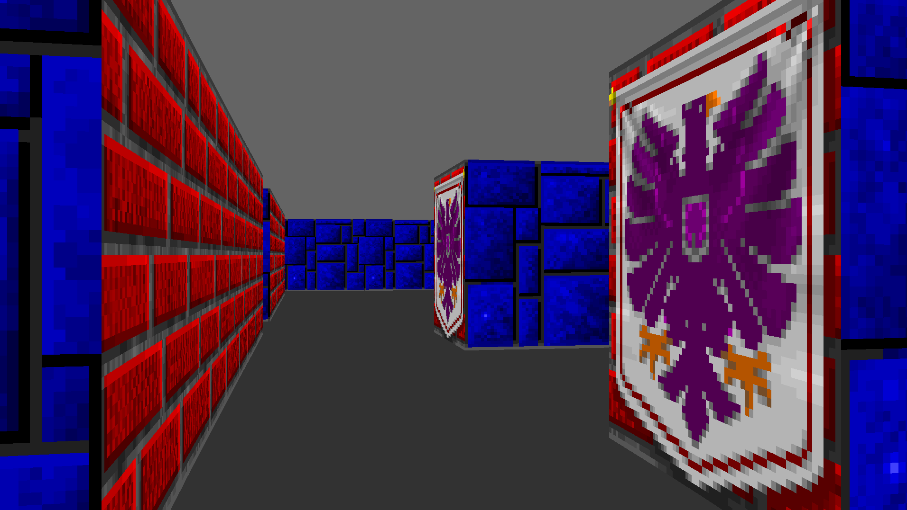
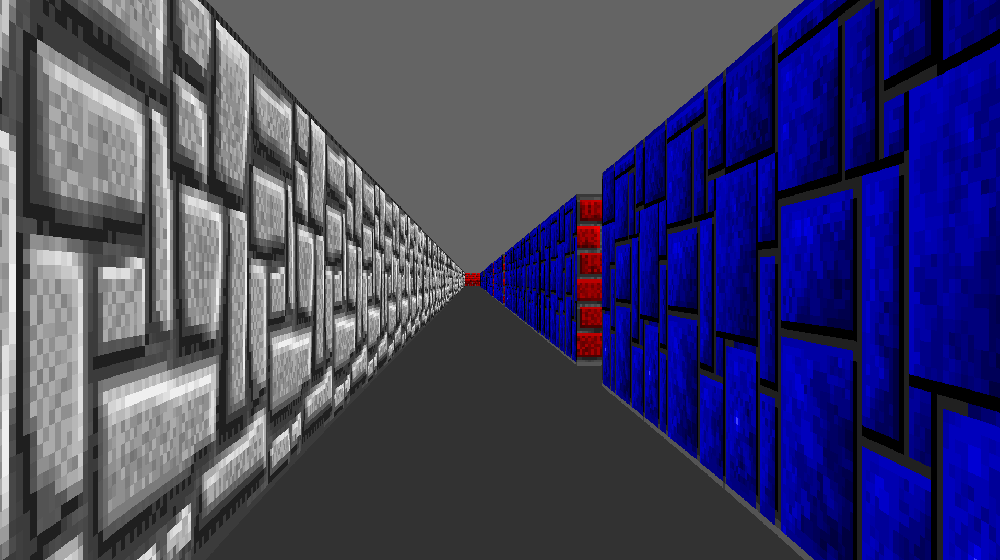

# Cub3D

Cub3D is a minimalist 3D engine inspired by classic shooters like *Wolfenstein 3D*.  
It renders a pseudo-3D world from a 2D map using the **raycasting** technique and the **DDA algorithm** for efficient wall detection.

Built entirely in **C** with **MiniLibX** for rendering, it features:
- Real-time movement and camera rotation
- Collision detection
- Textured wall rendering
- Simple, optimized rendering loop

The project explores how early 3D games simulated depth and perspective with limited resources — from calculating ray directions to projecting walls on screen.

This was a deep dive into graphics programming, vector math, and low-level game loops.

*(Originally inspired by the 42 project “Cub3D,” later expanded and refined for personal learning.)*

---

# 🕹 How to Run

## 1. Clone the repository

```bash
git clone <your-repo-url>
cd Cub3D
```

---

## 2. Install dependencies

### Linux (Ubuntu / Debian / WSL)

```bash
sudo apt update
sudo apt install -y build-essential cmake git libglfw3-dev libgl1-mesa-dev xorg-dev
```

### macOS

Install Homebrew if you do not already have it:

```bash
/bin/bash -c "$(curl -fsSL https://raw.githubusercontent.com/Homebrew/install/HEAD/install.sh)"
```

Then install the required dependencies:

```bash
brew install glfw cmake
```

---

## 3. Build the project

```bash
make
```

The Makefile will automatically:
- Clone MLX42
- Build MLX42
- Build libft
- Compile Cub3D

---

## 4. Run the program

```bash
./cub3D maps/example.cub
```

---

# 🎮 Controls

| Key      | Action                     |
| -------- | -------------------------- |
| W / S    | Move forward / backward    |
| A / D    | Strafe left / right        |
| ← / →    | Rotate camera left / right |
| ESC      | Exit the game              |

---

# 🧱 Textures

Cub3D supports custom wall textures.  
You can use any `.xpm` image file as a texture by placing it inside the `textures/` directory and updating your map configuration.

Example snippet from a map file:

```text
NO ./textures/stone.xpm
SO ./textures/brick.xpm
WE ./textures/wood.xpm
EA ./textures/metal.xpm
```

| Prefix | Meaning           |
| ------ | ----------------- |
| NO     | North-facing wall |
| SO     | South-facing wall |
| WE     | West-facing wall  |
| EA     | East-facing wall  |

---

# 📸 Screenshots

## Gameplay




---

# ⚙️ Technical Overview

- Language: C
- Rendering Library: MLX42 / MiniLibX
- Rendering Technique: Raycasting
- Collision System: Grid-based collision detection
- Texture Mapping: Direction-based wall texturing

### Graphics Concepts
- DDA Algorithm
- Vector math
- Camera plane calculations
- Perspective projection
- Real-time rendering loops

---

# 📚 Learning Goals

This project was focused on understanding:
- How early pseudo-3D engines worked
- Low-level graphics programming
- Real-time game loops
- Rendering optimization techniques
- Mathematics behind perspective projection and ray traversal